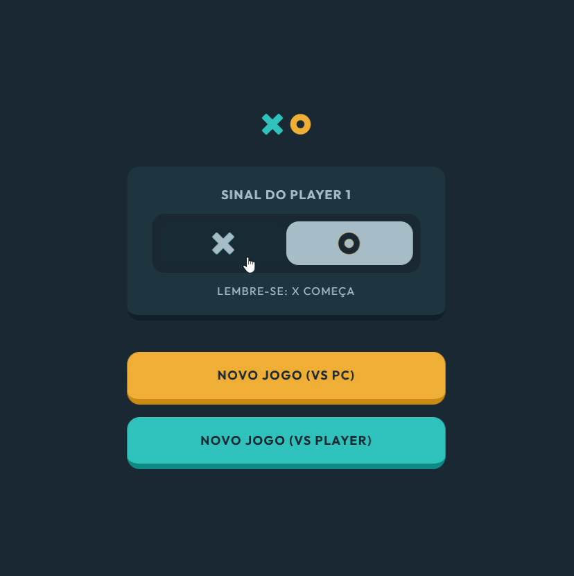

<h1 align="center">
    
    
    <p align="center">Jogo da Velha</p>
</h1>
<p align="center">
    <i align="center">Jogue contra uma IA ou contra outra pessoa 🎮</i>
</p>

Feito com React Hooks, Context e Reducer como parte dos meus estudos de React. A IA utiliza o algoritmo minmax.

<p align="center">
    
</p>

## 🚀 Como instalar

### Clone este repositório

```bash
git clone https://github.com/guidiasz/jogo-da-velha.git
```

### Acesse a pasta do projeto no terminal

```bash
cd jogo-da-velha
```

### Instale as dependências

```bash
npm install
```

### Inicie o servidor

```bash
 npm run dev
```

Agora basta abrir o link `http://localhost:3000` no navegador 😁

## Curtiu o projeto?

Considere dar uma estrela ⭐.

### Precisa de um dev front-end?

**[Pode conferir meu currículo por aqui](https://bit.ly/3h1Qewn)**.

## Copyright

Design feito por [frontendmentor.io](https://frontendmentor.io)
